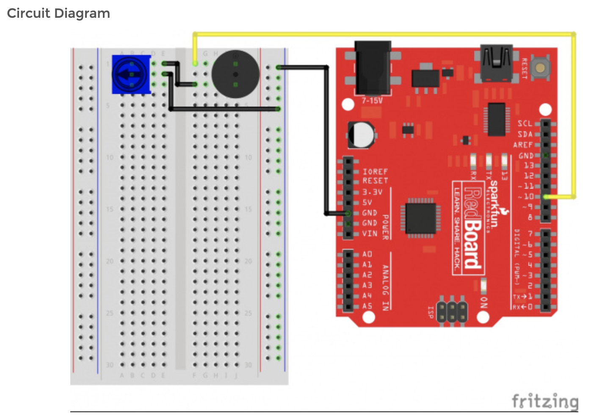

# Piezo Buzzer
NASA Space Grant Consortium, Summer 2019
Inspiration: https://learn.sparkfun.com/tutorials/experiment-guide-for-the-sparkfun-tinker-kit/experiment-5-reading-a-button-press

## Background
This is my first ever engineering project. I received a SparkFun Tinker Kit from the NASA Space Grant Consortium and one of the tutorial exercises was to use a piezo buzzer to play a song. 

I was extremely excited to try a song for myself so I played *Frankie Valli - Can't Take My Eyes Off of You* on the piano by ear and programmed the corresponding frequencies for the piezo buzzer to emit.

I love music and being able to program it into a piezo buzzer was super cool!

## Schematic 

